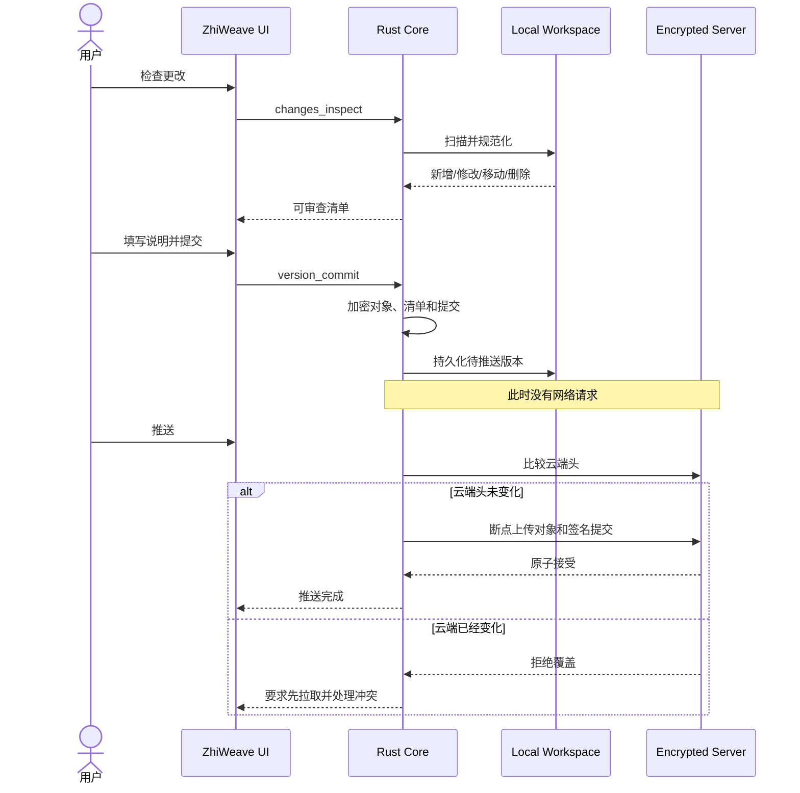
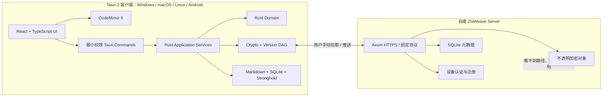

# 知织（ZhiWeave）产品与技术架构总纲

> 状态：已确认的开发基线
>
> 日期：2026-07-29
>
> 项目名：**知织 / ZhiWeave**
>
> 仓库名：`zhiweave`
>
> 许可证：`AGPL-3.0-or-later`
> 产品定位：跨平台、离线优先、端到端加密、Markdown 原生的学习型笔记软件

---

## 1. 一句话定义

知织不是一个“文件夹加编辑器”，而是一个把**问题、学习节点、资料、证据、代码实验、
论文、英文、复习卡、知识关系和可信版本**连接起来的个人学习系统。

它应当同时满足：

- Android、macOS、Linux、Windows 使用同一套产品逻辑；
- 本地离线时可以完整编辑、搜索和学习；
- 笔记以长期可读的 Markdown 为核心；
- 自建服务器只保存端到端加密后的数据；
- 多端同步像 Git 一样可检查、可提交、可拉取、可推送、可处理冲突；
- 用户只看到学习任务，不直接面对内部 ID、版本哈希、数据库字段和编号文件夹；
- 每次启动默认要求输入客户端密码，解锁后才能读取服务器资料和同步密钥；
- 可以生成适合网页 AI 的提示词，但未经用户主动操作不上传笔记；
- 知识树、学习进度、复习和来源验证都是一等功能，而不是后装插件。

---

## 2. 项目名称

### 2.1 已确认：知织 / ZhiWeave

“知”代表知识与求知，“织”代表把分散的事实、问题、证据和经验织成可以迁移的理解。
英文名 `ZhiWeave` 保留中文辨识度，也表达 knowledge weaving。

建议统一命名：

| 对象 | 名称 |
| --- | --- |
| 中文产品名 | 知织 |
| 英文产品名 | ZhiWeave |
| GitHub 仓库 | `zhiweave` |
| 客户端程序 | `zhiweave` |
| 服务端程序 | `zhiweave-server` |
| Docker 镜像 | `ghcr.io/<owner>/zhiweave-server` |
| 协议标识 | `ZHIWEAVE/1` |
| 本地隐藏目录 | `.zhiweave/` |

### 2.2 备选名称

| 名称 | 含义 | 评价 |
| --- | --- | --- |
| 知织 / ZhiWeave | 把知识织成网络 | 首选，独特且贴合产品 |
| 明径 / LumenPath | 让学习路径逐渐清晰 | 好听，但更像课程产品 |
| 知涟 / KnowRipple | 一个问题产生连续认知涟漪 | 有意境，但技术品牌辨识度稍弱 |
| 研环 / StudyLoop | 研究、验证、回顾形成闭环 | 含义直接，但英文同类名称较多 |

正式发布前还应检查 GitHub 组织名、域名、应用商店名称和商标冲突。项目从第一天使用
`zhiweave`；品牌必须只修改一份集中式配置，而不能散落在源码中。

---

## 3. 从现有 Learning Loop 项目继承什么

彻底停止支持 Obsidian，不等于把已经验证过的底层能力全部重写。

### 3.1 应复用

- Rust 文本与跨平台路径规范化；
- Vault 主密钥、Argon2id 密码派生和密钥包装；
- XChaCha20-Poly1305 加密对象；
- Ed25519 设备身份与签名提交；
- 加密清单、提交 DAG、父版本和多头历史；
- 断点续传、对象完整性验证和幂等提交；
- 服务端 SQLite 元数据与不透明对象存储；
- 路径碰撞、批量删除、篡改、断电恢复和多设备分支测试；
- Markdown 学习对象、AI 提示词和复习算法中的纯领域逻辑。

### 3.2 必须重写

- 所有 Obsidian API、插件生命周期、Modal、ItemView、SecretStorage 适配；
- Obsidian 文件监听、命令面板和主题 CSS；
- TypeScript 与 WebAssembly 之间为插件准备的桥；
- 编号文件夹直接作为界面的信息架构；
- 旧 Learning Loop 客户端设置和服务端部署协议。

### 3.3 新项目边界

新项目使用自己的 `ZHIWEAVE/1` 协议和空服务端数据目录。不要让 ZhiWeave 客户端尝试
兼容 Learning Loop/Obsidian 历史。旧 Vault 只通过一次性“导入 Obsidian Vault”流程
进入新系统：

1. 先复制并备份原 Vault；
2. 扫描 Markdown 与附件；
3. 识别旧 `ll_*` 属性并映射到隐藏数据库；
4. 展示清理预览；
5. 用户确认后生成干净 Markdown；
6. 创建 ZhiWeave 的第一个本地版本；
7. 用户手动推送到全新服务器。

---

## 4. 产品原则

### 4.1 Markdown 是内容真相

- 笔记正文是 UTF-8 Markdown；
- SQLite 是索引、关系和同步状态，不是唯一内容副本；
- 删除索引后可以从 Markdown 和隐藏元数据重建；
- 支持标准 Markdown、任务列表、表格、脚注、数学公式、Mermaid、代码块、Wiki 链接；
- HTML 默认禁用或严格清洗，防止脚本进入预览 WebView；
- 用户可以导出纯 Markdown，不被数据库或专有格式锁定。

### 4.2 技术元数据默认不可见

稳定 ID、设备 ID、对象版本、内容哈希、复习调度和同步状态存入 `.zhiweave/`，不写进
普通笔记的属性面板。用户主动创建的 `tags`、`authors`、`year`、`source` 等属性仍可
使用 YAML frontmatter。

### 4.3 离线优先

创建、编辑、搜索、知识树和复习不依赖服务器。网络失败不能阻止本地工作。

### 4.4 同步完全手动

自动保存只保存本地文件，不触发网络。以下操作严格分离：

1. 检查更改；
2. 提交本地版本；
3. 拉取云端版本；
4. 推送本地版本。

解锁、启动、切换前后台、定时器和文件修改都不得自动拉取或上传。

### 4.5 安全失败

- 云端在本地提交后变化时，拒绝推送；
- 本地 Vault 突然为空时，拒绝生成全量删除版本；
- 不确定能否合并时保留两份，不静默覆盖；
- 历史恢复创建新版本，不改写旧历史；
- 无实际变化时不允许创建空提交；
- 密码错误、指纹变化、签名失败和哈希失败必须显示不同错误。

### 4.6 学习任务优先于文件管理

用户首先看到“今天、继续学习、主题、知识树、资料、论文、实验、复习和版本控制”。
原始目录浏览器属于高级工具，不是首页。

---

## 5. 用户体验

## 5.1 启动流程

已有配置时：

```text
启动应用
→ 显示品牌化解锁窗口
→ 输入客户端加密密码
→ Rust 解锁本地加密配置和 Vault 密钥
→ 进入今日学习页
→ 不进行任何网络同步
```

首次使用时：

```text
启动应用
→ 创建本地空间或连接已有空间
→ 填写服务器地址、指纹、一次性注册凭证、客户端密码、设备名
→ 测试连接
→ 保存由客户端密码加密的完整配置
→ 初始化本地学习空间
→ 等待用户手动拉取或提交
```

客户端密码永不上传、永不明文持久化。解锁后的密钥只保存在当前进程内存，锁定或退出时
使用 `zeroize` 清除。

## 5.2 桌面布局

```text
┌──────────────────┬────────────────────────────────┬──────────────────┐
│ 学习导航          │ 当前笔记 / 知识树 / 版本控制    │ 上下文与下一步    │
│                  │                                │                  │
│ 今天              │ Markdown 编辑器                │ 当前目标          │
│ 继续学习          │ 阅读预览                       │ 来源与证据        │
│ 主题              │ 关系图                         │ AI 提示词         │
│ 资料与论文        │ 冲突对照                       │ 复习状态          │
│ 实验与记录        │                                │                  │
│ 复习              │                                │                  │
└──────────────────┴────────────────────────────────┴──────────────────┘
```

### 左侧

- 今天；
- 继续当前节点；
- 学习主题及进度；
- 资料与论文；
- 编程实验与技术记录；
- 英文词汇；
- 复习卡；
- 知识地图；
- 版本控制；
- 全局搜索。

### 中间

- Markdown 源码编辑；
- 阅读预览；
- 大纲；
- 可视化知识树；
- 版本差异；
- 冲突处理。

### 右侧

- 当前学习目标；
- “下一步做什么”；
- 相关节点；
- 来源和核实状态；
- 复制给 AI；
- 生成主题大纲提示词；
- 当前笔记完成标准。

## 5.3 Android 布局

手机使用底部五个一级入口：

```text
今天 | 学习 | 新建 | 复习 | 我的
```

- 编辑器使用全屏页面；
- 右侧上下文变为底部抽屉；
- 知识树默认显示当前路径，避免一次渲染整张大图；
- 同步和冲突使用独立全屏页面；
- 所有点击目标至少 44×44 CSS 像素；
- 必须专门测试中文输入法组合输入、长按选择、软键盘遮挡和返回手势。

## 5.4 快捷操作

桌面端提供可配置快捷键：

- 快速新建；
- 打开今天；
- 继续学习；
- 全局搜索；
- 复制当前上下文给 AI；
- 检查更改；
- 打开版本控制；
- 锁定。

Android 提供桌面快捷方式和分享入口：从浏览器分享文本或链接到“收集箱”。

---

## 6. 严格学习闭环

```text
提出问题
→ 创建主题
→ 生成或导入 Markdown 大纲
→ 拆分为学习节点
→ 写下当前理解
→ 收集来源与证据
→ 运行实验或反例
→ 修正理解
→ 提炼复习卡
→ 迁移到新问题
→ 回顾并形成版本
```

每个节点至少包含：

```markdown
# 节点标题

## 当前理解

## 为什么

## 边界条件

## 示例

## 实验或证据

## 容易混淆

## 待探索

## 相关知识

## 来源

## 修正记录
```

### 英文学习

- 术语；
- 技术含义；
- 原句；
- 挖空；
- 自己造句；
- 易混词；
- 来源；
- 自动生成复习卡。

### 编程学习

- 问题和假设；
- 最小可复现代码；
- 环境与版本；
- 执行命令；
- 实际输出；
- 失败与修正；
- 可重复验证步骤。

### 论文学习

- 元数据；
- 研究问题；
- 方法；
- 实验；
- 结果；
- 作者断言；
- 局限；
- 原文与翻译；
- 用户理解；
- 质疑；
- 提炼出的知识节点。

### 跨领域学习

一个节点可以关联多种材料，但每个节点只回答一个清晰问题。关系边包括：

- 前置；
- 支持；
- 反驳；
- 示例；
- 类比；
- 应用；
- 来源；
- 延伸。

---

## 7. AI 协作

第一阶段不内置任何云端模型密钥，也不在后台调用 AI。

应用只提供：

- 根据主题名称生成结构化 Markdown 大纲提示词；
- 根据当前节点、父子关系、来源和未解决问题生成一对一学习提示词；
- 自动排除疑似密码、令牌、私钥和连接凭据；
- 显示即将复制的完整内容；
- 用户点击后复制到剪贴板；
- 可选打开用户指定的网页 AI，但不自动粘贴或发送。

节点提示词应要求网页 AI：

1. 一次只问一个诊断问题；
2. 区分事实、推断和假设；
3. 对时效性事实要求检索可靠来源；
4. 编程结论要求最小实验；
5. 论文结论标注页码或章节；
6. 英文学习要求语境、造句和主动回忆；
7. 最后输出可写回节点的 Markdown；
8. 未达到完成标准前不要宣称掌握。

后续若增加模型 API，必须是可选适配器，密钥存入客户端密码保护的安全存储，调用前显示
数据范围，并允许完全关闭。

---

## 8. 技术选型

## 8.1 客户端：Tauri 2

选择：

- Tauri 2；
- React + TypeScript；
- Vite；
- CodeMirror 6；
- Rust 应用核心；
- CSS 设计令牌和自有组件层。

原因：

- Tauri 官方定位覆盖主要桌面和移动平台；
- Windows、macOS、Linux、Android 可以复用同一套 Web UI；
- Rust 可以直接复用现有加密、版本和服务端代码；
- 不再需要把 Rust 编译成 WASM 后再由插件调用；
- Tauri capabilities 可以限制 WebView 能调用的命令和文件范围；
- 官方文件系统、Stronghold、更新、深链和移动端插件可以按需使用；
- CodeMirror 6 官方强调移动输入、可访问性和 Markdown 支持。

官方依据：

- [Tauri 2 概览](https://v2.tauri.app/start/)
- [Tauri 桌面与 Android 开发依赖](https://v2.tauri.app/start/prerequisites/)
- [Tauri capabilities 安全边界](https://v2.tauri.app/security/capabilities/)
- [Tauri 文件系统插件](https://v2.tauri.app/plugin/file-system/)
- [Tauri Stronghold](https://v2.tauri.app/plugin/stronghold/)
- [CodeMirror 官方功能说明](https://codemirror.net/)

### 必须先做的技术验证

不要先写完整产品。第一周必须完成一个同时能在 Windows 和 Android 运行的垂直切片：

1. Tauri 窗口启动；
2. CodeMirror 编辑中英文 Markdown；
3. 中文输入法组合输入无重复、丢字；
4. Rust 写入应用私有目录；
5. `rusqlite` 建表和检索；
6. Stronghold 使用密码创建、关闭、重新解锁；
7. Rust 发起一次 HTTPS 请求；
8. Android 后台切换后不丢编辑内容。

任何一项失败，都在继续开发前解决或调整框架。

## 8.2 本地存储

### 内容目录

桌面端允许用户选择工作区；Android MVP 默认使用应用私有目录，并提供导入、导出和分享。
官方 Tauri 文件系统说明 Android 默认限制在应用目录，因此外部目录访问必须单独做权限
和持久授权设计。

```text
workspace/
├─ notes/
├─ attachments/
├─ exports/
└─ .zhiweave/
   ├─ workspace.json
   ├─ state.sqlite
   ├─ objects/
   └─ staging/
```

原则：

- Markdown 与附件是用户内容；
- `.zhiweave/` 是可重建或可恢复的内部状态；
- SQLite 不放在网络共享盘；
- 文件写入采用“同目录临时文件 → fsync → 原子替换”；
- 外部文件变更经过防抖扫描；
- 路径先规范化，再进入索引和同步。

### SQLite

使用 `rusqlite` 的 bundled SQLite，减少各平台系统库差异。开启 WAL、外键和定期 checkpoint。
SQLite 官方说明 WAL 允许读写并行但仍只有一个写者，并且依赖同机共享内存，因此不得把
数据库放在网络文件系统。

搜索使用：

- 标题、路径和 Markdown 正文索引；
- FTS5 trigram 支持中英文子串查找；
- 标签、类型和状态走普通索引；
- 关系图走 `edges` 表。

参考：

- [rusqlite bundled SQLite](https://docs.rs/crate/rusqlite/latest)
- [SQLite WAL](https://www.sqlite.org/wal.html)
- [SQLite FTS5 trigram](https://www.sqlite.org/fts5.html#the_trigram_tokenizer)

### 建议表

```text
workspaces
notes
note_paths
note_properties
links
learning_topics
learning_nodes
sources
review_cards
review_events
attachments
sync_records
commits
commit_parents
pending_operations
conflicts
staged_blobs
```

正文不重复存入普通关系表；FTS 表是派生索引。

## 8.3 编辑器

MVP 使用 CodeMirror 6 的 Markdown 源码编辑模式和安全预览，不先实现复杂所见即所得。

必须支持：

- Markdown 语法高亮；
- 标题折叠；
- 自动补全 Wiki 链接；
- 代码块语言；
- 搜索替换；
- 大纲跳转；
- 自动保存；
- 编辑历史；
- 中文、英文和双向文本；
- 手机选区与软键盘；
- 粘贴图片并生成相对链接；
- 格式化工具栏；
- 阅读与编辑切换。

所见即所得可以后续增加，但必须通过 Markdown 往返一致性测试，不能为了视觉效果破坏原文。

## 8.4 Rust 客户端核心

前端只负责展示和用户输入。文件、SQLite、加密、同步、路径验证和版本操作全部在 Rust。

前端不得直接：

- 读取任意文件系统路径；
- 操作数据库；
- 持有长期 Vault 主密钥；
- 生成签名提交；
- 直接访问同步服务器；
- 拼接协议消息。

推荐 Tauri 命令：

```text
profile_create
profile_unlock
profile_lock
connection_test
workspace_open
navigation_snapshot
note_open
note_save
note_create
note_delete
search
topic_create
outline_import
ai_prompt_build
review_due
review_grade
changes_inspect
version_commit
version_uncommit
cloud_pull
cloud_push
history_list
version_restore
conflicts_list
conflict_resolve
device_list
device_revoke
```

每个命令使用结构化输入和结构化错误码。TypeScript 只翻译错误，不依赖 Rust 错误字符串。

## 8.5 服务端

服务端继续使用 Rust：

- Tokio；
- Axum；
- SQLite；
- 不透明加密对象目录；
- HTTPS；
- 应用层固定版本协议；
- 设备签名；
- 分块和断点续传；
- Docker 与单文件二进制两种部署方式。

服务器可以知道：

- 不透明 Vault ID；
- 设备公钥；
- 加密对象大小；
- 提交图父子关系；
- 请求时间和来源 IP。

服务器不能知道：

- 文件路径；
- Markdown 内容；
- 附件内容；
- 提交说明；
- 学习主题；
- 客户端加密密码；
- Vault 主密钥；
- 设备私钥。

第一版只做单用户自建服务、多设备和多个本地学习空间。多租户、公开注册、团队实时协作
不进入 MVP。

---

## 9. 客户端密码与配置持久化

必须满足“服务器配置完整保存，但没有客户端密码就无法读取”。

本地只明文保留：

```text
格式版本
Argon2id 参数
随机 salt
加密快照位置
用于展示的非敏感空间别名（可选）
```

客户端密码解锁的加密快照包含：

```text
服务器 URL
端口
服务器静态指纹
访问凭据或注册结果
Vault ID
密码包装的 Vault 主密钥
设备私钥
设备名称
最后同步头
用户同步偏好
```

实现可使用 Tauri 官方 Stronghold，或复用现有 Argon2id +
XChaCha20-Poly1305 封装。无论选择哪种，密钥处理必须只在 Rust 侧，敏感值使用
`zeroize`，并编写错误密码、快照篡改、进程重启和崩溃恢复测试。

重要边界：如果用户选择普通 Markdown 工作区，Markdown 在本地磁盘上仍是明文。客户端
密码保护的是服务器配置、同步密钥和云端数据，不会神奇地加密外部 Markdown 文件。
本地设备仍需 BitLocker、FileVault、LUKS 或 Android 系统加密。将来可以增加“加密容器
模式”，但它会降低 Markdown 被其他工具直接读取的能力，不应混入 MVP。

---

## 10. 多端同步与协同

## 10.1 为什么不在 MVP 使用 CRDT

产品当前需要的是个人多设备、明确版本、手动同步和可审计冲突，不是多人同时编辑同一行。
CRDT 会显著扩大文本模型、附件、删除、重命名、加密和历史压缩的复杂度。

因此 MVP 采用：

- 内容寻址的加密对象；
- 有父版本的签名提交 DAG；
- Git 式手动拉取和推送；
- 三方合并；
- 冲突中心。

实时多人协作以后作为独立协议设计，不能破坏现有版本语义。

## 10.2 标准使用节奏

### 开始在设备 A 学习

```text
解锁
→ 手动拉取
→ 处理冲突
→ 编辑和学习
→ 检查更改
→ 提交版本
→ 手动推送
```

### 切换到设备 B

```text
解锁
→ 手动拉取
→ 确认已获得 A 的版本
→ 继续编辑
→ 检查、提交、推送
```

界面始终显示：

- 上次拉取时间；
- 上次推送时间；
- 当前本地头；
- 是否有待推送版本；
- 是否有未提交更改；
- 是否有未处理冲突。

由于产品承诺不自动联网，它不能在后台声称“云端没有变化”。未拉取时应显示“云端状态
尚未检查”，而不是“已同步”。

## 10.3 提交流程



## 10.4 拉取与冲突

拉取必须：

1. 获取父版本优先的提交图；
2. 校验设备签名；
3. 校验父版本存在；
4. 解密清单；
5. 校验 Merkle 根和对象哈希；
6. 计算共同祖先；
7. 对 Markdown 做保守三方合并；
8. 对二进制、Canvas 和无法安全合并的文件保留双方；
9. 在冲突中心生成可操作任务；
10. 不自动推送合并结果。

冲突界面提供：

- 左右对照；
- 共同祖先；
- 使用本地；
- 使用云端；
- 保留两份；
- 手工合并；
- 完成后创建合并版本。

不要把 Git 冲突标记直接写进用户笔记。

## 10.5 删除与历史

- 无变化时拒绝提交；
- 空工作区不得变成全部删除；
- 大批删除列出文件并要求输入确认语句；
- 历史恢复是非破坏性写回，然后创建新提交；
- 不能单独删除仍被后代引用的某个历史提交；
- 后续“压缩历史”应创建签名检查点，并在保留期后垃圾回收无引用对象；
- 压缩前生成恢复包并要求所有已登记设备确认。

---

## 11. 总体架构



### 分层约束

```text
UI
↓
Application Services
↓
Domain
↓
Ports
↓
Filesystem / SQLite / Crypto / Network Adapters
```

- Domain 不依赖 Tauri、React、SQLite 或 HTTP；
- Application Services 编排用例；
- Adapter 实现文件、索引、加密和网络；
- UI 只通过命令 DTO 访问应用服务；
- 服务端与客户端共享协议类型，但不共享客户端文件实现。

---

## 12. 建议仓库结构

```text
zhiweave/
├─ Cargo.toml
├─ Cargo.lock
├─ package.json
├─ pnpm-lock.yaml
├─ README.md
├─ LICENSE
├─ SECURITY.md
├─ CONTRIBUTING.md
├─ CHANGELOG.md
├─ apps/
│  └─ client/
│     ├─ src/
│     │  ├─ app/
│     │  ├─ components/
│     │  ├─ editor/
│     │  ├─ features/
│     │  │  ├─ unlock/
│     │  │  ├─ today/
│     │  │  ├─ notes/
│     │  │  ├─ learning/
│     │  │  ├─ review/
│     │  │  ├─ graph/
│     │  │  ├─ ai-prompts/
│     │  │  └─ version-control/
│     │  ├─ styles/
│     │  └─ generated/
│     ├─ src-tauri/
│     │  ├─ capabilities/
│     │  ├─ src/
│     │  └─ tauri.conf.json
│     └─ tests/
├─ crates/
│  ├─ zhiweave-domain/
│  ├─ zhiweave-application/
│  ├─ zhiweave-markdown/
│  ├─ zhiweave-storage/
│  ├─ zhiweave-search/
│  ├─ zhiweave-crypto/
│  ├─ zhiweave-versioning/
│  ├─ zhiweave-sync/
│  ├─ zhiweave-protocol/
│  └─ zhiweave-testkit/
├─ server/
│  ├─ src/
│  ├─ migrations/
│  ├─ Dockerfile
│  └─ config.example.toml
├─ packages/
│  ├─ ui/
│  └─ editor/
├─ protocol/
│  ├─ specification.md
│  ├─ threat-model.md
│  └─ test-vectors/
├─ docs/
│  ├─ product/
│  ├─ architecture/
│  ├─ adr/
│  ├─ deployment/
│  └─ handbook/
├─ scripts/
├─ fixtures/
└─ .github/
   ├─ ISSUE_TEMPLATE/
   └─ workflows/
```

---

## 13. 开发顺序

## 阶段 0：冻结旧项目

完成标准：

- Learning Loop 标记为 archived/maintenance；
- 不再增加 Obsidian 功能；
- 导出可复用 Rust crates 清单；
- 保存 29 个现有 Markdown 文件独立备份；
- 新项目使用新品牌、新协议和新数据目录。

## 阶段 1：跨平台技术尖峰

只实现：

- Windows 和 Android 启动；
- 解锁页；
- 一篇 Markdown 的打开、编辑、保存和预览；
- SQLite 索引；
- Stronghold 重启解锁；
- 一个 Rust 集成测试。

完成标准：

- 中文输入、软键盘、文件保存无已知阻断；
- Windows 与 Android 使用同一领域逻辑；
- 没有复制两套业务代码。

## 阶段 2：本地笔记 MVP

实现：

- 工作区；
- 学习导航；
- 编辑器；
- 搜索；
- Wiki 链接；
- 主题和节点；
- 今天；
- 资料、英文、论文、实验；
- 复习卡；
- AI 提示词复制；
- 导入旧 Vault；
- 导出纯 Markdown。

完成标准：

- 完全离线可完成一天的学习闭环；
- 10,000 篇测试笔记仍可使用；
- 用户不必看内部目录和 ID。

## 阶段 3：本地版本控制

实现：

- 检查更改；
- 提交说明；
- 无变化拒绝提交；
- 本地历史；
- 差异查看；
- 非破坏恢复；
- 大删除保护。

完成标准：

- 崩溃后待提交状态可恢复；
- 恢复不会删除额外本地文件；
- 属性、重命名和附件都有测试。

## 阶段 4：全新同步服务

实现：

- 新服务器初始化；
- 测试连接；
- 第一设备；
- 二维码/一次性令牌添加设备；
- 拉取；
- 推送；
- 多头历史；
- 三方合并；
- 冲突中心；
- 设备撤销；
- 断点续传。

完成标准：

- Windows 与 Android 双设备往返通过；
- 第三设备加入通过；
- 云端变化时旧客户端无法覆盖；
- 服务端数据库中找不到任何明文路径或正文。

## 阶段 5：macOS 与 Linux

完成标准：

- GitHub Actions 原生构建；
- macOS 签名和 notarization 流程；
- Linux AppImage 与 `.deb`；
- 文件监听、快捷键、系统字体和输入法验证；
- 平台差异写入测试矩阵。

## 阶段 6：公开测试版

完成标准：

- 安装文档；
- 一键 Docker Compose；
- 中英文 README；
- 截图和演示视频；
- 安全模型；
- 备份与恢复演练；
- SBOM、SHA-256 和签名产物；
- GitHub Release 可直接下载。

---

## 14. 测试策略

### Rust

- 单元测试；
- 属性测试；
- 路径和文本测试向量；
- 协议已知答案；
- 三设备随机提交图；
- 断点、重复、乱序和重放；
- SQLite 崩溃恢复；
- 错误密码和篡改；
- 模糊测试不可信 CBOR、帧和 Markdown 元数据。

### TypeScript

- 组件行为；
- 键盘和触摸；
- 编辑器命令；
- 导航状态；
- 无障碍；
- 错误码中文展示；
- 快捷键冲突。

### 端到端

- Windows 安装与升级；
- Android 真机；
- macOS Apple Silicon；
- Ubuntu LTS；
- 首次创建；
- 第二设备加入；
- 离线编辑；
- 并行修改；
- 删除/修改冲突；
- 大附件恢复；
- 服务器重启；
- 客户端进程被杀；
- 指纹突变；
- 磁盘空间不足。

Tauri 官方说明 WebDriver 测试在桌面平台能力不同，因此核心逻辑不能只依赖 UI E2E；必须
把大多数行为放进可直接测试的 Rust 应用层。

参考：[Tauri 测试说明](https://v2.tauri.app/develop/tests/)

---

## 15. 性能预算

这是验收目标，不是未经验证的宣传：

| 场景 | 目标 |
| --- | --- |
| 桌面冷启动到解锁页 | 1.5 秒以内 |
| Android 冷启动到解锁页 | 2.5 秒以内 |
| 10,000 篇笔记标题搜索 P95 | 100 毫秒以内 |
| 普通笔记输入响应 | 不出现可感知掉帧 |
| 打开 1 MB Markdown | 500 毫秒以内 |
| 知识树首屏 | 300 毫秒以内 |
| 100 MB 附件 | 分块、可暂停、可恢复 |
| 空闲状态 | 不轮询服务器、不持续高 CPU |

列表、搜索结果和大纲使用虚拟化。知识图只加载可见子图，不把整个 Vault 一次交给 DOM。

---

## 16. 安全清单

- 客户端密码不保存、不上传；
- 服务器配置由客户端密码加密；
- VMK 随机生成，不直接从密码得到；
- Argon2id 参数可升级；
- 每个设备独立 Ed25519 私钥；
- 对象使用独立随机 nonce；
- 协议版本进入认证数据；
- 路径和正文在上传前加密；
- 提交说明加密；
- HTML 预览清洗；
- 所有文件路径防穿越；
- ZIP 导入防 Zip Slip；
- 附件大小和解压大小有限制；
- Tauri capabilities 使用最小权限；
- 前端不能调用任意 shell；
- 更新包签名；
- 发布产物提供 SHA-256 与 SBOM；
- 日志自动过滤密码、令牌、私钥和笔记正文；
- 锁定后关闭会话并清理内存密钥；
- 安全问题使用私密 GitHub Security Advisory。

---

## 17. GitHub 开源与发布

## 17.1 开源内容

仓库首发必须有：

- `README.md`：产品截图、30 秒上手、下载链接；
- `README.zh-CN.md`；
- `LICENSE`；
- `SECURITY.md`；
- `CONTRIBUTING.md`；
- `CODE_OF_CONDUCT.md`；
- 架构文档和威胁模型；
- 路线图；
- Issue 与 Pull Request 模板；
- 可复现构建说明；
- 服务端 Docker Compose；
- 示例配置中没有真实密码或主机信息。

项目许可证已确定为 `AGPL-3.0-or-later`。任何人都可以使用、研究和修改，但通过网络向
用户提供修改版本时也必须向这些用户提供对应源代码。复用现有 Apache-2.0 代码时仍须
保留原版权和许可证声明。

## 17.2 CI

Pull Request 必须运行：

```text
cargo fmt --check
cargo clippy --all-targets --all-features -D warnings
cargo test --workspace --all-features
pnpm lint
pnpm typecheck
pnpm test
前端生产构建
协议兼容性测试
依赖与许可证检查
```

标签 `v*` 触发：

- Windows 安装包；
- macOS `.dmg`；
- Linux AppImage 与 `.deb`；
- Android `.apk` 和 `.aab`；
- 服务端 Windows/Linux/macOS 二进制；
- 服务端 Docker 多架构镜像；
- SHA-256；
- SBOM；
- GitHub draft release。

GitHub 官方支持用 Actions 构建 Rust、上传产物，并以 tag 为基础创建附带二进制的 Release；
Docker 镜像可以发布到 GHCR。

参考：

- [GitHub Actions 构建 Rust](https://docs.github.com/en/actions/tutorials/build-and-test-code/rust)
- [GitHub Releases](https://docs.github.com/en/repositories/releasing-projects-on-github/about-releases)
- [发布 Docker 镜像到容器仓库](https://docs.github.com/en/actions/tutorials/publish-packages/publish-docker-images)
- [Tauri 各平台分发](https://v2.tauri.app/distribute/)

## 17.3 快捷安装

最终用户应该只需要：

### 服务端

```bash
docker compose up -d
```

首次日志输出：

```text
管理地址
服务器指纹
一次性设备注册二维码/代码
健康检查结果
```

### 客户端

- Windows：下载签名安装程序；
- macOS：下载 notarized DMG；
- Linux：下载 AppImage 或 `.deb`；
- Android：GitHub APK，稳定后进入 Google Play；
- 应用内更新只安装签名版本。

GitHub 的 `releases/latest` 可以提供稳定的“始终下载最新版”链接。

---

## 18. 首批 GitHub Issues

```text
#1  ADR：确认名称、许可证和品牌常量
#2  建立 Cargo + pnpm monorepo
#3  创建 Tauri React TypeScript 客户端
#4  Windows + Android CodeMirror 中文输入尖峰
#5  Rust WorkspaceProvider 抽象
#6  Markdown 原子保存和外部变更监听
#7  SQLite schema、迁移和 FTS5 搜索
#8  Stronghold 客户端密码解锁
#9  学习导航和今日页
#10  主题、节点和 Markdown 大纲导入
#11  AI 提示词预览与复制
#12  英文、论文、实验和复习卡
#13  导入 Learning Loop/Obsidian Vault
#14  抽取 crypto/versioning crates
#15  本地检查、提交、历史和恢复
#16  ZHIWEAVE/1 协议规范与威胁模型
#17  新服务端初始化和连接测试
#18  第一设备与一次性配对
#19  手动拉取、推送和断点续传
#20  三方合并与冲突中心
#21  Windows/Android 双设备验收
#22  macOS/Linux 构建与适配
#23  Docker Compose 与备份恢复
#24  GitHub Actions 多平台发布
#25  公开 beta 安全与文档审查
```

---

## 19. 快速开发纪律

每个功能都按以下顺序：

```text
写用户场景
→ 写失败条件
→ 定义领域接口
→ 先写测试
→ 实现 Rust 核心
→ 暴露最小 Tauri 命令
→ 实现 UI
→ 做 Windows 和 Android 验证
→ 更新文档
```

强制规则：

- UI 不承载同步真相；
- 不用字符串解析错误；
- 不在日志中记录笔记；
- 不在数据库迁移失败时偷偷重建；
- 不在冲突时默认覆盖；
- 不在无变化时创建版本；
- 不为了兼容开发期旧格式污染新协议；
- 不先做动画再做恢复；
- 不宣称某平台支持，除非该平台安装包和核心流程实际通过。

---

## 20. MVP 明确不做

- Obsidian 插件兼容；
- 实时多人共同编辑；
- 在线账号注册平台；
- 内置 AI 代替用户自动发送笔记；
- 插件市场；
- Web 浏览器版；
- iOS 首发；
- 复杂所见即所得；
- 云端明文全文搜索；
- 任意祖先提交删除；
- 自动后台同步。

这些不是永远不做，而是不允许拖慢第一条完整、可靠的跨平台学习闭环。

---

## 21. 最终验收

只有同时满足以下条件，才能称为可公开 beta：

- Windows、macOS、Linux、Android 均有可安装产物；
- 同一份领域逻辑在四个平台运行；
- 启动密码窗口和锁定可靠；
- 服务器配置持久化且受客户端密码保护；
- 本地 Markdown 可独立备份和读取；
- 学习主题、节点、英文、编程、论文、复习和知识树闭环可执行；
- 网页 AI 提示词必须由用户预览并主动复制；
- 同步严格手动；
- 两设备和三设备同步测试通过；
- 云端变化不会被旧设备覆盖；
- 冲突不会静默丢数据；
- 空 Vault 不会生成全量删除；
- 服务器无法读取路径、正文和提交说明；
- 服务端可用 Docker Compose 快速部署；
- GitHub Release 包含安装包、服务端、校验值、SBOM 和部署文档；
- 备份恢复演练成功；
- 文档中的支持范围与真实测试一致。

---

## 22. 已确认的项目决策

1. 产品名：**知织 / ZhiWeave**；
2. 仓库名：`zhiweave`；
3. 许可证：`AGPL-3.0-or-later`；
4. 客户端：Tauri 2 + React + TypeScript + CodeMirror 6；
5. 核心：Rust；
6. 同步：离线优先、Git 式手动版本；
7. 服务端：自建、端到端加密、全新协议；
8. Obsidian：停止支持，只提供一次性导入。

其他技术决策先按本文档启动第一阶段尖峰，在 Windows 与 Android 得到真实结果后通过 ADR
修正，不重新引入 Obsidian 兼容层。
